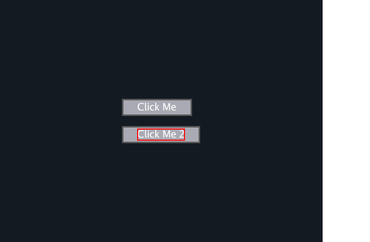
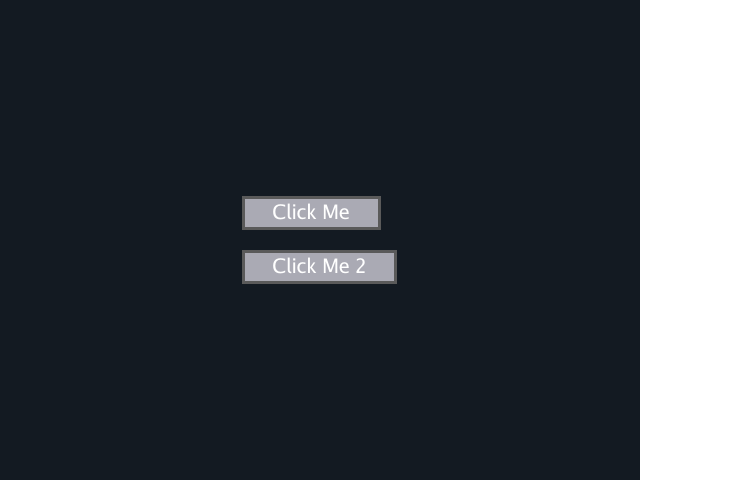

<p align="center">
    
</p>

# Ebitest

[](https://pkg.go.dev/github.com/xescugc/ebitest)

Ebitest is a lib to test Ebiten UI through inputs and asserting on what should be on the screen.

## Requirements

There are a few dependencies/requirements in order to run Ebitest at it's fullest.

To run the test **headless**, meaning without having the game open on a screen, you need to install [Xvfb](https://www.x.org/archive/X11R7.7/doc/man/man1/Xvfb.1.xhtml), but
that is only available on Linux (and X server) for others I did not investigate yet. With this then you can just do `xvfb-run go test ./...` (check the [Makefile](./Makefile)).

To fake all the events (click, scroll, mouse move) I use [robotgo](https://github.com/go-vgo/robotgo) so I would recommend checking their README for specific
requirements depending on the OS you have.

## Installation

With Go module support (Go 1.11+), just import:

```golang
import "github.com/xescugc/ebitest"
```

Otherwise, to install the ebiteset package, run the command:

```
go get github.com/xescugc/ebitest
```

## Usage

Simple API that has:
* `Should(s)` and `ShouldNot(s)`: Not stop execution when fails
* `Must(s)` and `MustNot(s)`: Stop execution if assertion fails

When asserting the `s` can be many things:
* `string`: To search that string on the screen (the Color and Face have to be provided on the initialization of Ebitest.Run)
* `image.Image`: Search that specific image on the screen
* `*ebiten.Image`: Searches that specific image
* `*ebitest.Selector`: Searches for the selector internal image

When using a positive assertion (`Should` or `Must`) they return also the `*ebitest.Selector` so then you can interact with it
like doing a `.Click()`.

Initialize Ebitest with `ebitest.Run(t, g)` with `t *testing.Test` and `g ebiten.Game`. A few extra options are available like:
* `WithFace|Color`: To set the default values when the using the assertions with a text value.
* `WithDumpErrorImages`: Which will generate an image when a test fail with the failed assertion on the folder `_ebitest_dump/`

If you need some extra interactions that are not implemented (yet) you can directly use [robotgo](https://github.com/go-vgo/robotgo),
but those may fail as they are not synchronized internally so I would recommend opening an issue and I'll add it.

## Example

This is a simple test in which there is a Game with just a button that when clicked switches the test in it from `Click Me` to `Clicked Me`

```golang
package ebitest_test

import (
	"image/color"
	"testing"

	"github.com/go-vgo/robotgo"
	"github.com/hajimehoshi/ebiten/v2"
	"github.com/stretchr/testify/assert"
	"github.com/xescugc/ebitest"
	"github.com/xescugc/ebitest/testdata"
)

func TestGameButton(t *testing.T) {
	face, _ := testdata.LoadFont(20)
	g := testdata.NewGame()
	et := ebitest.Run(g,
		ebitest.WithFace(face),
		ebitest.WithColor(color.White),
		ebitest.WithDumpErrorImages(),
	)
	defer et.Close()

	robotgo.Move(0, 0)
	robotgo.Click("left", true)

	assert.True(t, g.Clicked)

	et.PingPong.Ping()

	text1 := "Click Me"
	text1_2 := "Click Me 2"
	text2 := "Clicked Me"

	t1s := et.Must(t, text1)
	t1_2s, _ := et.Should(t, text1_2)

	// Fails
	et.ShouldNot(t, text1_2)
	et.ShouldNot(t, text2)

	// Fails
	et.Should(t, text2)

	t1s.Click()

	et.Should(t, text1_2)
	et.Should(t, text2)

	t1_2s.Click()

	et.ShouldNot(t, text1)
	et.ShouldNot(t, text1_2)
	assert.Len(t, et.GetAll(text2), 2)

	et.KeyTap(ebiten.KeyI, ebiten.KeyShift)
	assert.True(t, g.ClickedShiftI)
}
```

An output could be for example

```
--- FAIL: TestGameButton (9.34s)
    ebitest_test.go:39: 
                Error Trace:    ebitest.go:150
                                                        ebitest_test.go:39
                Error:          selector found
                                image at: ebitest/_ebitest_dump/019b2e81-8d9a-7bb7-ba16-639756d11e58.png
                Test:           TestGameButton
    ebitest_test.go:43: 
                Error Trace:    ebitest.go:126
                                                        ebitest_test.go:43
                Error:          selector not found
                                image at: ebitest/_ebitest_dump/019b2e81-966e-7715-8c5f-6a6acc92720c.png
                Test:           TestGameButton
FAIL
FAIL    github.com/xescugc/ebitest      9.393s
FAIL
make: *** [Makefile:7: test] Error 
```

And then you have the `image at: ebitest/_ebitest_dump/019b2e81-8d9a-7bb7-ba16-639756d11e58.png` that expects to not find something, and it finds
it and reports the image with the highlight of what was found. At the top right you can see what was looking for.

<p align="center">
    
</p>

And the `image at: ebitest/_ebitest_dump/019b2e81-966e-7715-8c5f-6a6acc92720c.png` that expect to find something that was not found. At the top right
you can see what was looking for.

<p align="center">
    
</p>


## Run it on a CI

If the CI has low resources (like GitHub Actions) it'll most likely fail (check `Known issues#2`) but you
can check what I install for it to run on the [`go.yml`](.github/workflows/go.yml)

## Known issues and Limitations

1/ You cannot have more than 1 test case

Basically you cannot run more than one test as even calling `Ebitest.Close()` there are some resources missing and you may get an error like

> panic: ebiten: NewImage cannot be called after RunGame finishes [recovered, repanicked]

2/ Some false positive/negative

Due to the nature of this test (the game is running on a goroutine) there may be the case in which an input is not registered by the game
so an expectation may randomly fail.

I kind of fixed it (100 consecutive test pass) using a custom [PingPong](./ping_pong.go) and [TicTacToe](./tic_tac_toe.go) that basically forces a context switch and synchronizes Input+Game.Update+Game.Draw but it still fails in low resource like GitHub [Actions](https://github.com/xescugc/ebitest/actions) for example.

3/ Size of the screen

By default the screen is of `640x480` if using `xvfb`. To make it bigger you can directly increase the size with `ebiten.SetWindowSize(750, 750)`, though setting big sizes
I've seen it causes some issues that the click are not where they are expected to be and are a bit off and miss which causes errors.

## Plans

* Add more helpers for assertions (like animations)
* Add more inputs (potentially just port all the [robotgo](https://github.com/go-vgo/robotgo) lib) synchronized
* Others
